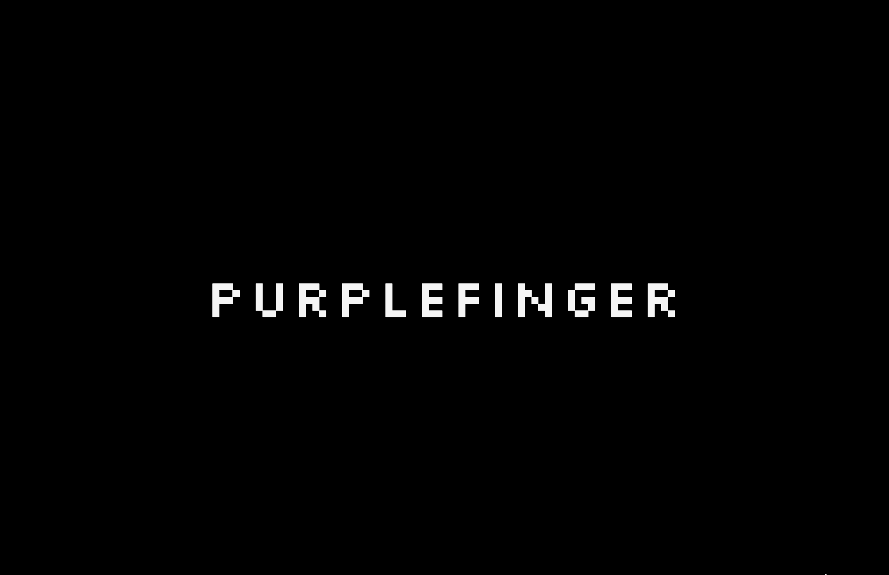
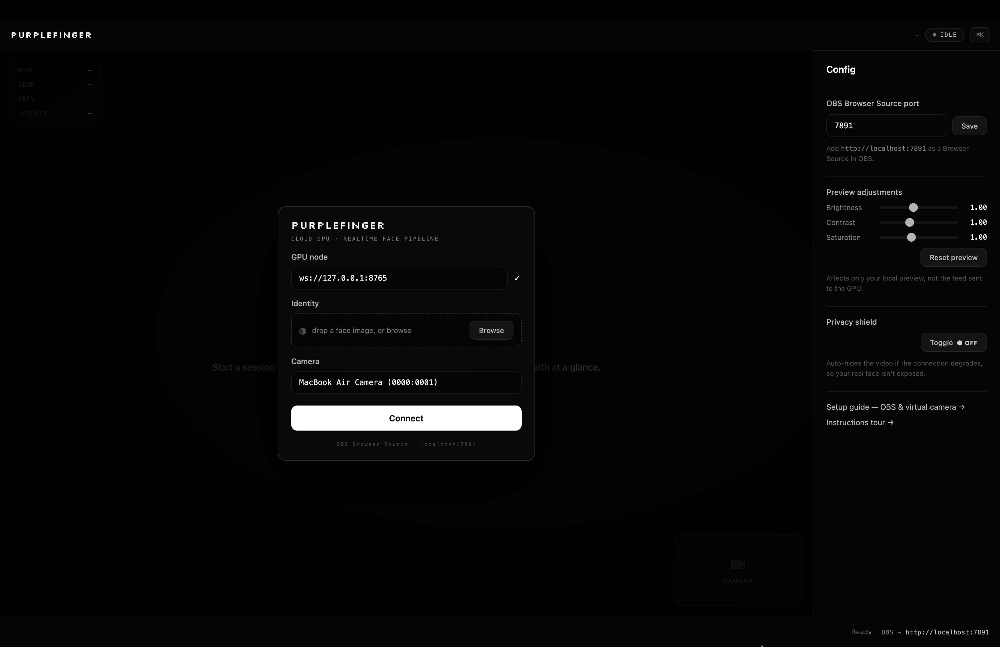

# Purplefinger



Purplefinger is a real-time face-swap system that decouples capture and display
from inference. A lightweight desktop client streams webcam frames over a
WebSocket to a GPU node running the swap pipeline, then renders the returned
frames — so the client carries no GPU dependency and runs on commodity Windows
or macOS hardware. The GPU node can run anywhere with an NVIDIA GPU: a local
machine, a rented instance, or an ephemeral cloud GPU provisioned only for the
duration of a session.

Output is exposed as a local OBS Browser Source, so the swapped stream becomes a
standard virtual camera consumable by any video application — conferencing,
streaming, or recording.



## Architecture

Inference is the latency-sensitive, compute-heavy stage, so it is separated from
the client to keep the client thin and portable:

```
[ client ]  capture → JPEG encode → WebSocket ─┐
    ▲                                           ▼
    │                                     [ GPU node ]  detect → swap → enhance
    └──── display + OBS Browser Source ◄── WebSocket ───┘
```

- **Client** (`chimera-lite/electron-client/`, Electron) — webcam capture,
  hardware JPEG encoding, frame transport, display, and a local OBS Browser
  Source server. No GPU required.
- **GPU node** (`chimera-lite/gpu-node/`) — an HTTP/WebSocket server on port
  `8765` wrapping the inference pipeline; distributed as a Docker image.
- **Transport** — JPEG frames over a single WebSocket. There is no control
  plane: the client connects directly to a node URL (`ws://host:8765`); no
  backend, accounts, or telemetry.

Because inference is remote, the GPU is decoupled from the user's machine and its
lifetime — a cloud instance can be brought up per session and released afterward,
so commodity hardware drives RTX-class inference without local provisioning.

## Pipeline

- **Detection + swap** — InsightFace `inswapper_128` via `onnxruntime-gpu`.
- **Enhancement** — GFPGAN / CodeFormer face restoration.
- **Acceleration** — TensorRT FP16 with engine caching where available
  (≈2–3× over the plain CUDA execution provider), yielding ~sub-20 ms per-frame
  inference on RTX-class GPUs. The capture-loop and backpressure analysis behind
  the achieved throughput is documented in [`docs/realtimemath.md`](docs/realtimemath.md).

## Quick start

1. **Start a GPU node.** Run the prebuilt image on any NVIDIA host, exposing TCP
   `8765`:

   ```bash
   docker run --gpus all -p 8765:8765 \
     ghcr.io/saintheraldfaust/purplefinger-gpu:latest
   ```

   On a cloud provider (e.g. RunPod) deploy the same image and use the mapped
   public address, e.g. `ws://203.0.113.5:40123`. See
   [`chimera-lite/gpu-node/`](chimera-lite/gpu-node/).

2. **Run the client.**

   ```bash
   cd chimera-lite/electron-client
   npm install
   npm start
   ```

3. **Connect.** Enter the node URL, select a source face, and connect. Add
   `http://localhost:7891` as an OBS Browser Source to expose the result as a
   virtual camera.

## GPU node API (port 8765)

| Endpoint | Purpose |
|---|---|
| `GET /health` | Readiness (`{ ok, gpu }`) |
| `POST /set-face` | Multipart source-face image |
| `POST /set-mode` | `{ profile }` — quality/throughput profile |
| `WS /ws` | Bidirectional JPEG frame stream |

## Building

```bash
cd chimera-lite/electron-client
npm run dist        # Windows (NSIS)
npm run dist:mac    # macOS (dmg/zip)
```

GPU image build instructions: [`chimera-lite/gpu-node/`](chimera-lite/gpu-node/).

## Responsible use

Intended for entertainment, performance, visual effects, and research, used with
consent. Not for deception, fraud, impersonation, or non-consensual use.

## License

[AGPL-3.0](LICENSE).
